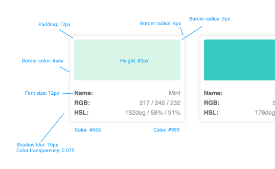

# Generar una paleta de colores

Haciendo uso de mapas y bucles has de generar una página con la paleta de colores que se indica en la imagen a continuación:

Has de mostrar las siguientes informaciones:

* el nombre del modificador de bloque
* el nombre del color
* el valor en RGB del color
* el valor en HSL del color

## Colores:

- primary: #d9f5e8 y se llama Mint
- success: #37cbc2 y se llama Teal
- warning: #fb3 y se llama Gold
- danger: #ff6347 y se llama Tomato

Tienes a disposición el siguiente fragmento de código HTML para generarla _card_ cada color:

  

  <dl class="card__details">
    <dt class="card__term">Name:</dt>
    <dd class="card__desc card__desc--name"></dd>
    <dt class="card__term">RGB:</dt>
    <dd class="card__desc card__desc--rgb"></dd>
    <dt class="card__term">HSL:</dt>
    <dd class="card__desc card__desc--hsl"></dd>
  </dl>

